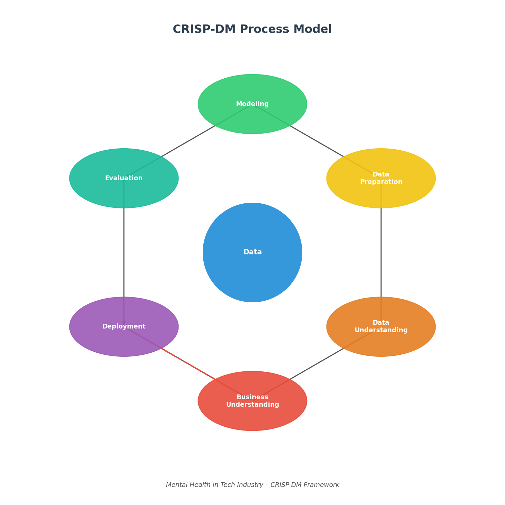

# Mental Health in Tech – CRISP-DM Analysis

Predicting mental health treatment-seeking behavior in the tech industry using the CRISP-DM framework and machine learning classification models.

## Project Overview

This project analyzes the [OSMI Mental Health in Tech Survey](https://osmihelp.org/research) dataset to understand what workplace and demographic factors predict whether a tech employee will seek mental health treatment. We apply the **CRISP-DM** (Cross-Industry Standard Process for Data Mining) methodology end-to-end, from business understanding through deployment recommendations.

## Business Problem

> **Can we predict whether a tech employee will seek mental health treatment based on workplace and demographic factors?**

Mental health issues are prevalent in the tech industry. Identifying the key drivers of treatment-seeking behavior helps organizations design better benefit programs, reduce stigma, and proactively support employees.

## Dataset Description

The dataset (`data/survey.csv`) is based on the OSMI Mental Health in Tech Survey and contains responses from 1,259 tech industry employees. Key columns include:

| Column | Description |
|--------|-------------|
| `Age` | Respondent age |
| `Gender` | Respondent gender |
| `Country` | Country of employment |
| `family_history` | Family history of mental illness (Yes/No) |
| `treatment` | **Target** – sought mental health treatment (Yes/No) |
| `work_interfere` | How often mental health interferes with work |
| `benefits` | Whether employer provides mental health benefits |
| `care_options` | Awareness of mental health care options |
| `anonymity` | Whether anonymity is protected when seeking help |
| `supervisor` | Comfort discussing mental health with supervisor |
| `no_employees` | Company size |
| `remote_work` | Whether the respondent works remotely |

## CRISP-DM Framework



This project follows the six CRISP-DM phases:

1. **Business Understanding** – Define the prediction problem and success criteria
2. **Data Understanding** – Explore the dataset, check distributions and missing values
3. **Data Preparation** – Clean data, handle outliers, engineer features, encode variables
4. **Modeling** – Train Logistic Regression (baseline), Random Forest, and Decision Tree with GridSearchCV
5. **Evaluation** – Compare models using Accuracy, Precision, Recall, and F1-score
6. **Deployment & Recommendations** – Derive actionable business insights

## Summary of Findings

- **Family history** of mental illness is the strongest predictor of treatment-seeking behavior
- Employees with access to **mental health benefits** are significantly more likely to seek treatment
- **Workplace anonymity** and **supervisor support** are critical enablers
- **Logistic Regression**, **Random Forest**, and **Decision Tree** were compared across Accuracy, Precision, Recall, and F1-score

## Business Recommendations

1. **Improve mental health benefit awareness** – Communicate available resources clearly during onboarding and annually
2. **Ensure confidentiality** – Guarantee anonymity for mental health disclosures
3. **Train supervisors** – Provide mental health first aid training for all managers
4. **Address stigma** – Normalize mental health conversations through company-wide culture initiatives
5. **Support remote workers** – Offer virtual mental health resources and regular check-ins

## Project Structure

```
tech-mental-health-classification/
│
├── README.md
├── requirements.txt
├── data/
│   └── survey.csv
├── notebooks/
│   └── mental_health_analysis.ipynb
└── images/
    └── crisp_dm_diagram.png
```

## Link to Notebook

📓 [Mental Health Analysis Notebook](notebooks/mental_health_analysis.ipynb)

## Setup & Installation

```bash
pip install -r requirements.txt
jupyter notebook notebooks/mental_health_analysis.ipynb
```

